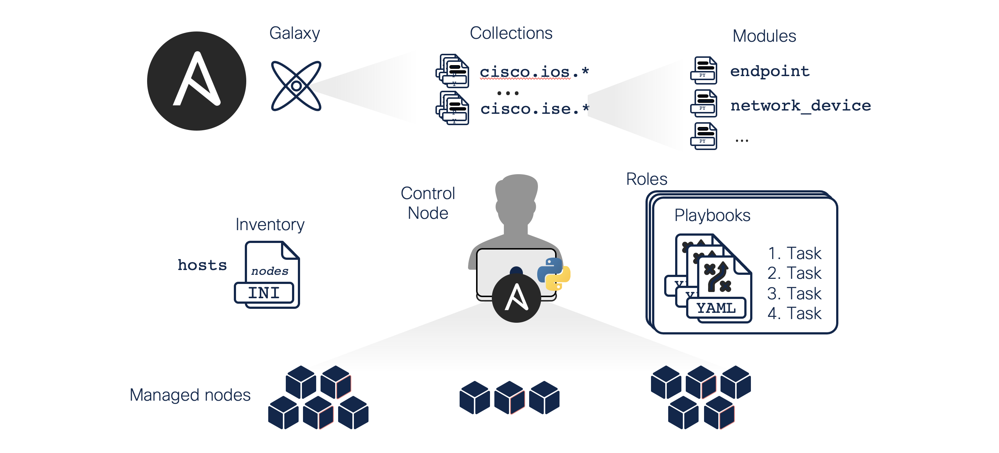

# Ansible Concepts

[Ansible Concepts](https://docs.ansible.com/ansible/latest/user_guide/basic_concepts.html) are common to all uses of Ansible. Understand them to use Ansible for any kind of automation. This basic introduction provides the background that helps you to understand the rest of the Lab and how to use Ansible in the future.

