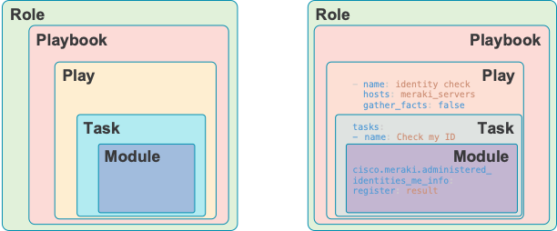

## Your First Ansible Playbook

The best way to get started using Ansible is to run playbooks. That is why we are here.
All Ansible playbooks are written in [YAML (Yet Another Markup Language)](https://yaml.org/). YAML is similar to the JSON without the curlies and quotes. YAML is to JSON what Markdown is to HTML, if that makes sense to you.



The use of Roles and Playbooks is advanced so don't worry about that for now. Understand their place in the hierarchy.

1. 
2. Use your favorite editor to create and save a file named hosts (no extension):
```
[meraki_servers]
meraki_server
```
3. Create and save a playbook file named who_am_i.yaml with the following contents.

> ⟁ Be careful with the spacing and alignment of text in YAML files. If you deviate from this strict formatting, you get the errors. JavaScript uses {}s to create structured blocks of data whereas YAML uses spaces. That is why it looks so clean - no curly braces - but you must be diligent with the spaces.


```
---
- hosts: meraki_servers
  gather_facts: false
  tasks:
    - name: Get my administered identities
      cisco.meraki.administered_identities_me_info:
      register: result

    - name: Show result
      ansible.builtin.debug:
        msg: "{{ result }}"
```

4. Run the playbook using the command:

```bash
ansible-playbook -i hosts who_am_i.yml
```

<details><summary>Click here to see the expected output</summary>
<pre><code>
PLAY [meraki_servers] ***************************************************************************************************************************************************************************************

TASK [Get my administered identities] ***********************************************************************************************************************************************************************
ok: [meraki_server]

TASK [Show result] ******************************************************************************************************************************************************************************************
ok: [meraki_server] => {
    "msg": {
        "changed": false,
        "failed": false,
        "meraki_response": {
            "authentication": {
                "api": {
                    "key": {
                        "created": true
                    }
                },
                "mode": "email",
                "saml": {
                    "enabled": false
                },
                "twoFactor": {
                    "enabled": false
                }
            },
            "email": "devnetmerakiadmin@cisco.com",
            "lastUsedDashboardAt": "2023-01-31T16:18:46.000000Z",
            "name": "DevNet Meraki Admin"
        },
        "result": ""
    }
}

PLAY RECAP **************************************************************************************************************************************************************************************************
meraki_server              : ok=2    changed=0    unreachable=0    failed=0    skipped=0    rescued=0    ignored=0</code></pre>
</details> 
