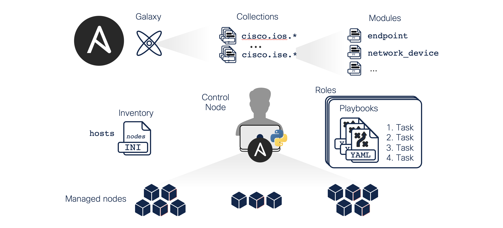

# Ansible Concepts

[Ansible Concepts](https://docs.ansible.com/ansible/latest/user_guide/basic_concepts.html) are common to all uses of Ansible. Understand them to use Ansible for any kind of automation. This basic introduction provides the background that helps you to understand the rest of the Lab and how to use Ansible in the future.

* **Control node**: Any machine with Ansible installed. You can run Ansible commands and playbooks by invoking the `ansible` or `ansible-playbook` command from any control node. You can use any computer that has a Python installation as a control node - laptops, shared desktops, and servers can all run Ansible. However, **_you cannot use a Windows machine_** as a control node. You can have multiple control nodes.
* **Managed nodes**: The network devices (and/or servers) you manage with Ansible. Managed nodes are also sometimes called “hosts”. Ansible is not installed on managed nodes.
* **[Inventory](https://docs.ansible.com/ansible/latest/user_guide/intro_inventory.html)**: A configuration file where you define a list of managed nodes (hosts) by hostname or IP. The default host inventory file after installation is located in `/etc/ansible/hosts`. Ansible requires SSH access from the Ansible server to items in your inventory. An inventory can also organize managed nodes, creating, and nesting groups for easier scaling.
* **[Module](https://docs.ansible.com/ansible/latest/user_guide/modules.html)**: A reusable standalone script that Ansible runs on your behalf, either locally or remotely. Modules interact with your local machine, an API, or a remote system to perform specific tasks. You can invoke a single module with a task or invoke several different modules in a playbook. Ansible provides a module library with its base installation, but custom modules such as ([cisco.meraki](https://galaxy.ansible.com/cisco/meraki)) are also available.
* **[Tasks](https://docs.ansible.com/ansible/latest/user_guide/basic_concepts.html#tasks)**: Actions that are executed and performed by playbooks. Tasks are mapped to the actions that Ansible performs on the end systems. Ansible executes tasks sequentially against any devices that match the defined pattern. When you view the shell feedback of a playbook run, you see the output from the individual tasks and their success or failure.
* **[Playbooks](https://docs.ansible.com/ansible/latest/user_guide/playbooks_intro.html#about-playbooks)**: A file in which you define policy applications, declare configurations, orchestrate steps, and launch tasks. Each playbook is composed of one or more “plays”. Playbooks are maintained and managed in a version control system. They are written in YAML (Yet Another Markup Language).
* **[Roles](https://docs.ansible.com/ansible/latest/user_guide/playbooks_reuse_roles.html)**: An organizational component that enables you to combine automation content and make it reusable. Roles can be assigned to a set of hosts to organize tasks. This means that instead of creating a monolithic playbook, you can create multiple roles and assign each role to complete a unit of work. For example, you can define a webserver role to install Apache on a specified group of servers.
* **[Handlers](https://docs.ansible.com/ansible/latest/user_guide/playbooks_handlers.html)**: Similar to tasks, except that a handler is executed only when it is called by an event. For example, a handler starts the HTTPS service after a task installs HTTPS. The handler is called by the notify directive. The name of the notify directive and the handler must be the same.
* **[Templates](https://docs.ansible.com/ansible/latest/user_guide/playbooks_templating.html)**: Files based on the Jinja2 template engine with a `.j2` extension. You could place the contents of your index.html file into a template file. However, template files are most useful and powerful when you use variables. You can use Ansible’s facts and even call custom variables in these template files.
* **[Variables](https://docs.ansible.com/ansible/latest/user_guide/playbooks_variables.html)**: You can use custom-made variables in your playbooks. Variables can be defined in several different ways. You will learn more about the different ways of using variable later. For now, you must be aware that they exist and can be used within the Ansible playbooks.
* **[Collections](https://docs.ansible.com/ansible/latest/collections/index.html#list-of-collections)**: A distribution format for Ansible content that can include playbooks, roles, modules, and plugins. You can install and use collections through Ansible Galaxy. See [Using collections](https://docs.ansible.com/ansible/latest/user_guide/collections_using.html#collections).
* **[Ansible Galaxy](https://galaxy.ansible.com/)**: In addition to the default Ansible-provided modules, you can also write your own modules for your own needs. Vendors take advantage of this functionality and [write modules for specific technologies](https://galaxy.ansible.com/cisco/). These modules are then hosted on Ansible Galaxy. You can get module using the `ansible-galaxy` command-line tool.
